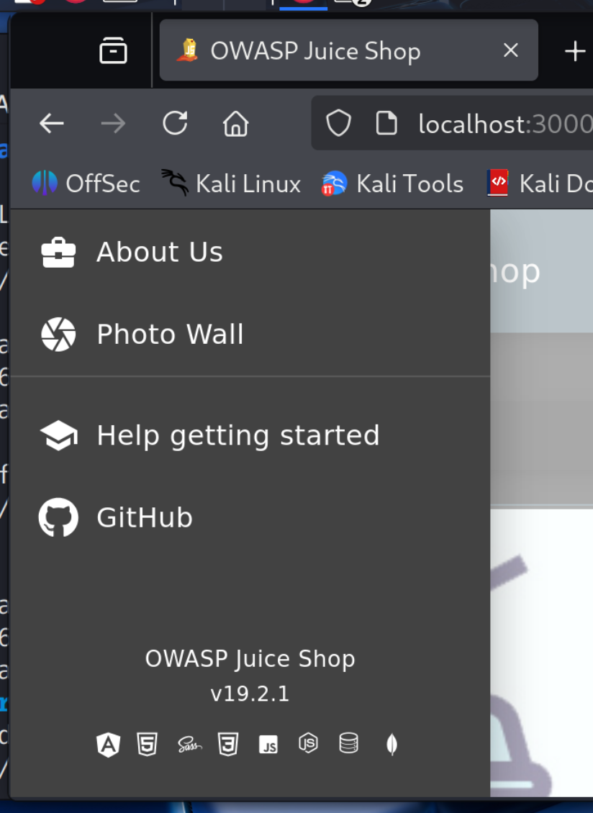
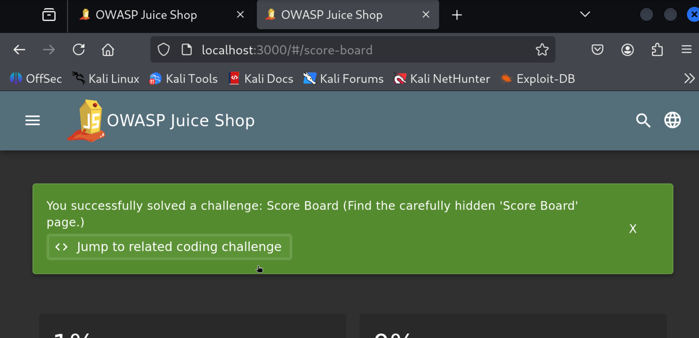
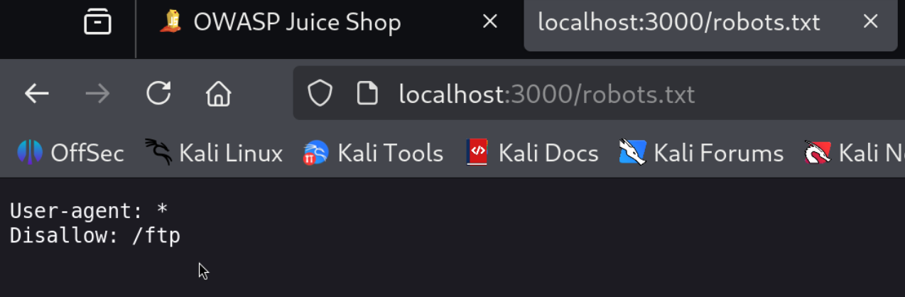
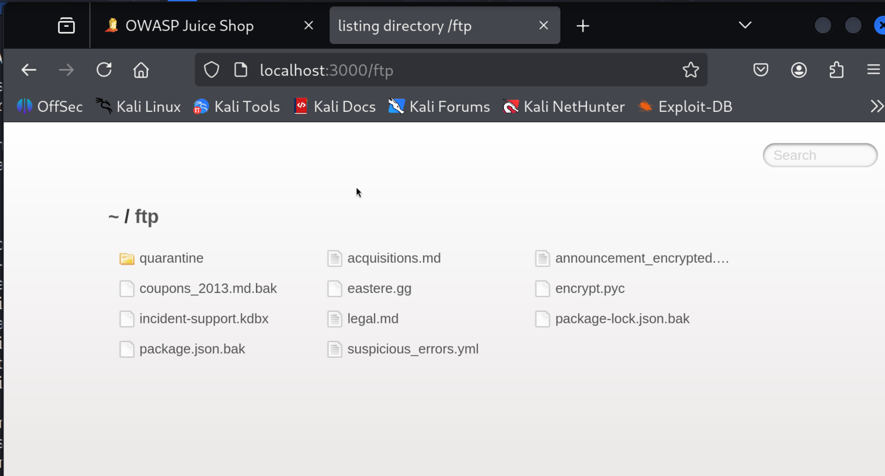
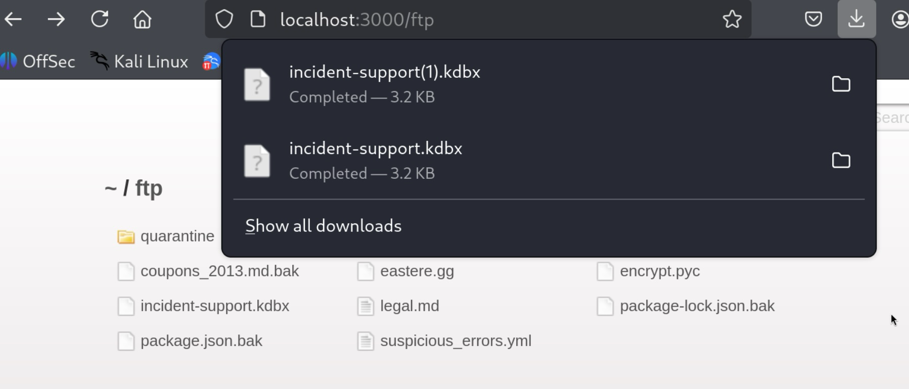
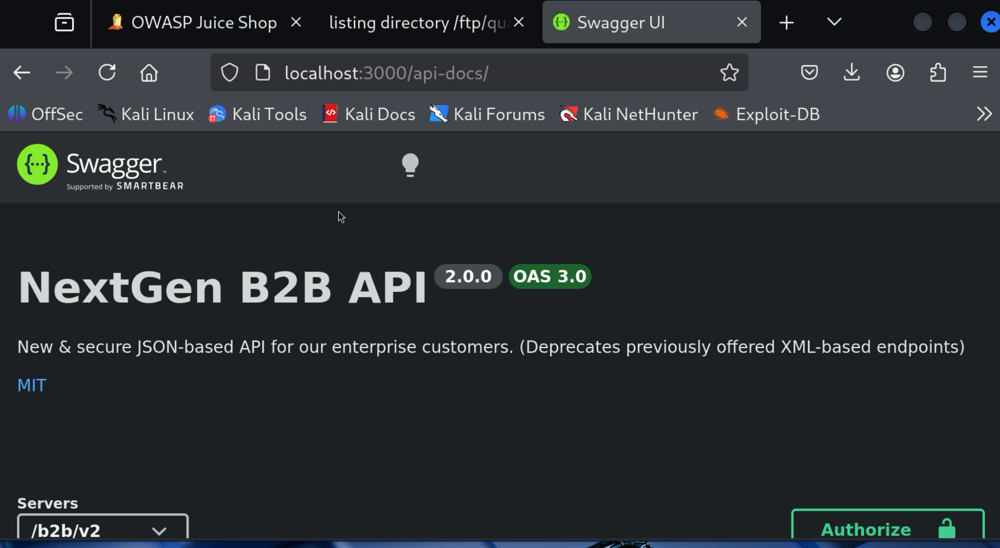
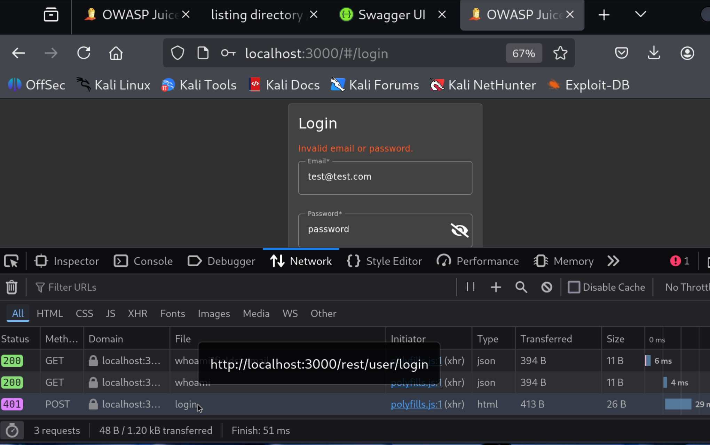
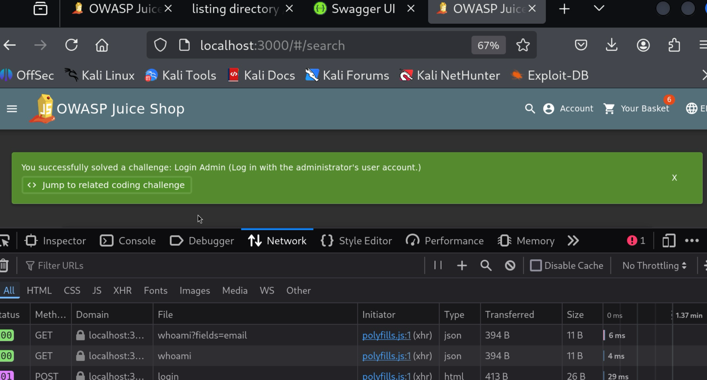
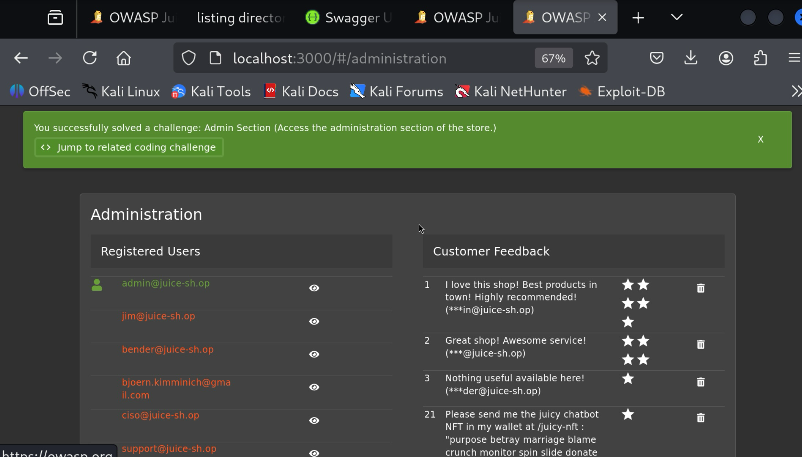
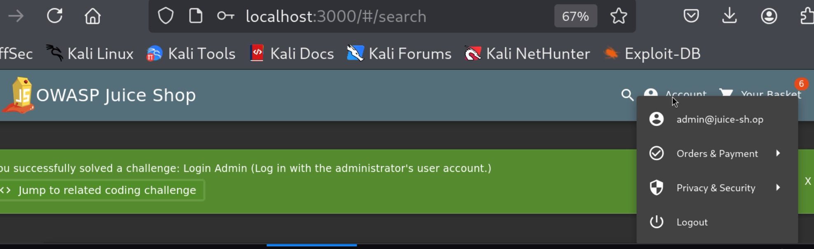

 OWASP Juice Shop — Penetration Test Write-Up

**Target:** OWASP Juice Shop v19.2.1  
**Attacker Machine:** Kali Linux (VMware Fusion on macOS)  
**Testing Type:** Black-box web application penetration test  
**Environment:** Intentionally vulnerable local lab (Docker)  
**Date:** March 2026  
---

## Overview

OWASP Juice Shop is a deliberately vulnerable Node.js web application designed for practicing web application security testing. This write-up documents a full attack chain executed against the application — from initial reconnaissance through authentication bypass and privilege escalation — mapping each finding to the OWASP Top 10.

**Challenges Completed:** 3  
**Phases Covered:** Reconnaissance · Authentication Bypass · Privilege Escalation  

---

## Environment Setup

```bash
# Pull and run Juice Shop via Docker
docker run -d -p 3000:3000 --name juice-shop bkimminich/juice-shop

# Confirm container is running
docker ps

# Access target
http://localhost:3000
```

| Detail | Value |
|---|---|
| Target URL | http://localhost:3000 |
| Framework | Angular SPA (Node.js backend) |
| Container | Docker — bkimminich/juice-shop:latest |
| Attacker OS | Kali Linux |

---

## Phase 1: Reconnaissance

### Methodology

Juice Shop is a Single Page Application (SPA) using Angular's hash-based routing (`/#/`). Traditional page source inspection yields no meaningful links since all routing is handled client-side by the Angular framework. Reconnaissance required JS bundle analysis rather than standard crawling.

---

### Finding 1 — Hidden Routes via JS Bundle Extraction

**Severity:** Informational  
**OWASP:** A01 - Broken Access Control



Angular compiles all client-side routes into a single JS bundle (`main.js`). Extracting these routes exposes the full application attack surface without any authentication.

**Command:**
```bash
curl http://localhost:3000/main.js | grep -oP '(?<=path:")[^"]+' | sort -u
```

**Selected Routes of Interest:**
```
administration
forgot-password
login
register
score-board      ← hidden, not linked in UI
accounting
chatbot
wallet-web3
```

**Challenge Completed:** Score Board — navigating to `http://localhost:3000/#/score-board` directly confirms the hidden route is accessible. The page is never linked in the UI and is only discoverable via JS analysis.

---

### Finding 2 — Sensitive Paths Disclosed via robots.txt

**Severity:** Medium  
**OWASP:** A05 - Security Misconfiguration



`robots.txt` is intended to instruct search engine crawlers — but listing sensitive paths under `Disallow` advertises those paths to any attacker who checks the file.

**URL:** `http://localhost:3000/robots.txt`  
**Disclosed Path:** `/ftp`

---

### Finding 3 — Unauthenticated FTP Directory with Sensitive Files

**Severity:** Critical  
**OWASP:** A05 - Security Misconfiguration




Browsing to `/ftp` reveals a publicly accessible directory requiring no authentication. The directory contains multiple sensitive files available for direct download.

**URL:** `http://localhost:3000/ftp`

| File | Risk |
|---|---|
| `incident-support.kdbx` | KeePass password vault — downloadable without auth, susceptible to offline brute-force |
| `package.json.bak` / `package-lock.json.bak` | Application dependency backups — reveals internal tech stack and potentially vulnerable packages |
| `acquisitions.md` | Internal business document exposed publicly |
| `encrypt.pyc` | Compiled Python encryption script — may reveal encryption logic |
| `suspicious_errors.yml` | Internal configuration/error data |
| `quarantine/` | Subdirectory containing files named `juicy_malware_linux`, `juicy_malware_windows` — malware samples accessible without authentication |

In a real engagement, the exposure of a KeePass vault and malware samples on an unauthenticated public endpoint would warrant an immediate critical finding and escalation to the client.

---

### Finding 4 — Unauthenticated Swagger API Documentation

**Severity:** High  
**OWASP:** A05 - Security Misconfiguration



The application's full API specification is publicly accessible via Swagger UI without any authentication, providing an attacker with a complete map of all available endpoints, HTTP methods, and expected parameters — eliminating the need for manual API enumeration.

**URL:** `http://localhost:3000/api-docs`

---

## Phase 2: Authentication Bypass via SQL Injection

**Severity:** Critical  
**OWASP:** A03 - Injection  
**Challenge Completed:** Login Admin ⭐⭐





### Objective

Bypass the login form to gain unauthorized access to the admin account without valid credentials.

### Target Endpoint

```
POST /rest/user/login
```

Confirmed via Firefox DevTools (Network tab) by observing the request fired on a failed login attempt. The server returned a `401 Unauthorized` with the message `"Invalid email or password"`.

### Vulnerability

The application passes user-supplied input directly into a SQL query without sanitization or parameterization, allowing an attacker to inject arbitrary SQL logic and manipulate query behavior.

The application likely constructs a query similar to:
```sql
SELECT * FROM Users WHERE email = '[input]' AND password = '[input]'
```

### Payload

| Field | Value |
|---|---|
| Email | `' OR 1=1--` |
| Password | (any value) |

### How It Works

The injection transforms the query to:
```sql
SELECT * FROM Users WHERE email = '' OR 1=1--' AND password = '...'
```

`OR 1=1` evaluates as always true, causing the query to return the first record in the Users table — which is the admin account. The `--` sequence comments out the remainder of the query, neutralizing the password check entirely.

### Result

Successfully authenticated as `admin@juice-sh.op` without valid credentials.

---

## Phase 3: Privilege Escalation — Admin Panel Access

**Severity:** Critical  
**OWASP:** A01 - Broken Access Control  
**Challenge Completed:** Admin Section ⭐⭐




![full admin panel list]

Browsing to '/administration' leads to full admin panel list...

### Objective

Access the restricted administration panel using the admin session obtained via SQL injection.

### Attack Chain

This phase demonstrates how individual vulnerabilities chain together into a high-impact attack:

```
Recon (JS bundle) → Discovered /administration route
        ↓
SQLi Auth Bypass → Obtained valid admin session
        ↓
Direct navigation → Full admin panel access
```

### Vulnerability

The administration panel performs no additional authentication or role verification beyond the inherited session cookie. Any valid admin session grants immediate unrestricted access — there is no step-up authentication, no re-verification, and no additional access control layer protecting the panel.

### Target URL

```
http://localhost:3000/#/administration
```

### Result

Full administration panel accessible, exposing:

- Complete registered user list with email addresses (`admin@juice-sh.op`, `jim@juice-sh.op`, `bender@juice-sh.op`, `ciso@juice-sh.op`, and others)
- Customer feedback including partially unmasked user email addresses
- Administrative delete controls for users and reviews — functional without any further authorization

---

## Summary of Findings

| # | Finding | Severity | OWASP |
|---|---|---|---|
| 1 | Hidden routes extracted from JS bundle | Info | A01 |
| 2 | Sensitive path disclosed in robots.txt | Medium | A05 |
| 3 | Unauthenticated FTP directory with sensitive files | Critical | A05 |
| 4 | KeePass vault downloadable without authentication | Critical | A05 |
| 5 | Malware samples in publicly accessible directory | Critical | A05 |
| 6 | Swagger API docs exposed without authentication | High | A05 |
| 7 | SQL injection authentication bypass | Critical | A03 |
| 8 | Admin panel accessible via broken access control | Critical | A01 |

---

## Tools Used

| Tool | Purpose |
|---|---|
| Firefox DevTools | JS bundle analysis, network request inspection |
| curl | Route extraction from main.js |
| Docker | Target environment setup |
| Kali Linux | Attacker machine |

---

## Key Takeaways

- **SPAs require different recon techniques** — standard crawling misses client-side routes entirely. JS bundle analysis is essential.
- **robots.txt is not a security control** — it discloses sensitive paths to attackers while providing no actual protection.
- **Vulnerability chaining amplifies impact** — none of these findings exist in isolation. Recon fed the SQLi target, SQLi enabled privilege escalation, and escalation exposed the full user base.
- **Input sanitization is non-negotiable** — a single unsanitized query parameter led to full admin compromise.

---
## Phase 4: DOM-Based Cross-Site Scripting (XSS)

**Severity:** High  
**OWASP:** A03 - Injection  
**Challenge Completed:** DOM XSS ⭐

### Objective
Inject and execute malicious client-side JavaScript via the 
application's search field.

### Target
Search bar at http://localhost:3000/#/search

### Vulnerability
The search field reflects user input directly into the page's DOM 
without sanitization. The browser interprets the injected content as 
HTML/JavaScript rather than plain text, allowing arbitrary client-side 
code execution.

### Payload
```
<iframe src="javascript:alert(`xss`)">
```

### How It Works
The application takes the search query and renders it back into the 
page unsanitized. Injecting an `<iframe>` tag with a `javascript:` 
protocol in the `src` attribute causes the browser to execute the 
JavaScript directly. The `alert()` function confirms code execution — 
in a real attack this could be used to steal session cookies, redirect 
users to malicious sites, or perform actions on behalf of the victim.

### Result
Browser alert dialog triggered from localhost:3000 confirming 
successful JavaScript execution in the victim's browser context.


### OWASP Reference: A03 - Injection
### Severity: High
### Challenge Completed: DOM XSS (Difficulty: 1/5 ⭐)

*This write-up was produced in a controlled lab environment against an intentionally vulnerable application for educational purposes.*
